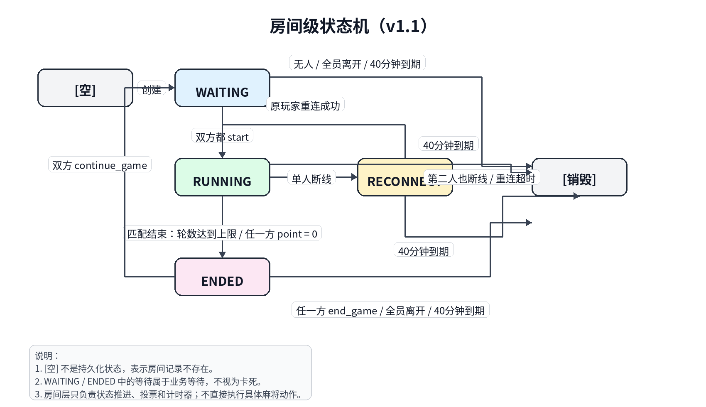

# 房间模块设计文档

**版本：** v1.1  
**日期：** 2026-03-30  
**作者：** kenny  
**修订说明：** 本版本在 v1.05 基础上，重点重构房间级状态机，并同步修正协议、计时器、Redis 模型、边界场景与测试计划。核心变化包括：  
- 引入 `[空] -> WAITING` 的显式创建语义  
- `WAITING -> RUNNING` 改为**双方都明确选择开始**后才进入  
- 新增**房间 40 分钟绝对生命周期**，到时无条件销毁  
- `RUNNING -> ENDED` 不再以和牌/流局本身触发，而改为**轮数到上限**或**任一方 point=0**  
- `ENDED` 改为“**一方结束则销毁；双方继续则回到 WAITING**”  
- 双方同时断线时，**直接销毁房间**  
- 房间层继续保持“**只负责定时器调度与生命周期管理，不直接执行游戏动作**”的边界

---

## 目录

1. [背景与目标](#1-背景与目标)  
2. [范围与非目标](#2-范围与非目标)  
3. [需求映射表](#3-需求映射表)  
4. [现有代码分析与改造点](#4-现有代码分析与改造点)  
5. [核心对象设计](#5-核心对象设计)  
6. [房间级状态机设计（v1.1）](#6-房间级状态机设计v11)  
7. [Redis 数据模型设计](#7-redis-数据模型设计)  
8. [WebSocket 通信协议设计](#8-websocket-通信协议设计)  
9. [断线重连流程设计](#9-断线重连流程设计)  
10. [游戏状态快照设计](#10-游戏状态快照设计)  
11. [定时器与超时机制设计](#11-定时器与超时机制设计)  
12. [错误码与边界场景设计](#12-错误码与边界场景设计)  
13. [新增文件结构](#13-新增文件结构)  
14. [测试计划](#14-测试计划)  
15. [实现顺序建议](#15-实现顺序建议)

---

## 1. 背景与目标

### 1.1 背景

Chinitsu Showdown 是一款二人实时清一色麻将对战 Web 游戏。现有的 `managers.py` 中 `ConnectionManager + GameManager` 同时承担连接管理、房间管理与部分生命周期控制，存在以下问题：

- 房间创建、加入、离开和游戏生命周期没有清晰分层
- `RUNNING` 期间断线后缺少完整的重连恢复闭环
- 服务端缺少主动推送协议，前端无法同步房间级变化
- 缺少房间寿命控制，房间可能长期悬挂
- 等待开始、结束后继续/结束、双方断线等场景缺少显式状态机
- 房间层和游戏层边界不够清楚，容易互相侵入

### 1.2 目标

本次设计文档旨在：

1. 明确房间模块职责边界，重构为独立、可测试、可扩展的模块  
2. 设计完整的房间生命周期状态机  
3. 支持稳定的断线重连机制（单人断线可恢复，双方断线直接销毁）  
4. 设计可靠的游戏快照保存与重连恢复视图  
5. 引入 Redis 作为运行时状态存储与并发协调组件  
6. 补充服务端主动推送协议  
7. 增加房间 40 分钟绝对寿命，避免僵尸房间  
8. 让“开始游戏”“继续游戏/结束游戏”成为明确的房间级决策过程

### 1.3 非目标声明

本版本 **不承诺** 以下能力：

- 服务端重启后恢复进行中的房间与对局
- 通过 Redis 重建内存中的 `ChinitsuGame` 对象
- 多实例之间迁移 WebSocket 会话
- 房间层直接执行具体麻将动作或回合合法性判断

Redis 在 v1.1 中的作用是：

- 保存房间元数据、玩家会话、开始/继续投票状态
- 保存游戏快照，供重连后恢复客户端视图
- 为关键并发路径提供原子性保障
- 为未来可能的重启恢复/多实例扩展保留结构

---

## 2. 范围与非目标

### 2.1 本模块负责

| 类别 | 内容 |
|------|------|
| 房间管理 | 房间创建、加入、离开、满员拒绝、同 ID 拒绝、空房销毁 |
| 生命周期 | `[空] / WAITING / RUNNING / RECONNECT / ENDED / DESTROYED` 状态流转 |
| 连接会话 | WebSocket 绑定、在线/离线标记、断线占位、旧连接保护 |
| 开始流程 | WAITING 状态下双方分别确认开始，双确认后再启动游戏 |
| 重连恢复 | RUNNING 期间单人断线进入 RECONNECT；重连成功后恢复 RUNNING |
| 快照 | 保存当前局面、按视角裁剪、重连后单播 |
| 主动推送 | 加入通知、准备状态变更、断线/重连通知、快照恢复、房间过期、结束决策等 |
| 定时器调度 | 房间 40 分钟绝对寿命、重连超时、回合等待超时的挂载/取消/到点回调 |
| 房间级结束判断 | 基于快照判断“轮数达到上限 / 任一方 point=0”后进入 ENDED |
| 结束后决策 | 一方结束则销毁；双方继续则回到 WAITING |

### 2.2 本模块不负责

- 麻将具体规则、和牌判定、算分、役种判定 → `game.py` / `agari_judge.py`
- JWT 鉴权、数据库查询 → `auth.py` / `database.py`
- 前端 UI 逻辑
- 牌山牌面顺序生成
- 游戏层回合合法性判断本身
- 自动动作的具体执行（例如真正执行 `skip_ron`、判负、结算）

### 2.3 身份字段约定

为避免 PRD 初版中“昵称作为 player_id”的歧义，本设计统一约定：

| 字段 | 含义 | 来源 | 用途 |
|------|------|------|------|
| `user_id` | 用户唯一标识（UUID / DB 主键） | JWT / 数据库 | 房间成员身份、重连校验、内部主键 |
| `display_name` | 昵称 | JWT / 用户资料 | 仅用于展示 |
| `room_name` | 房间名 | 客户端输入 | 房间定位 |

统一原则：

- **昵称仅用于展示，不用于重连身份校验**
- **重连只认 `user_id + room_name`**
- `duplicate_id` 指同一房间内已有相同 `user_id` 的在线会话
- 若产品后续要求“展示昵称在同房间不可重复”，应作为独立展示约束处理

---

## 3. 需求映射表

> 说明：本节同时包含 PRD 原始需求与本次状态机修订后新增的房间级约束。

### 3.1 原始需求映射

| 需求编号 | 描述 | 当前落地方式 |
|----------|------|-------------|
| ROOM-01 | 房间名 1~20 字符 | `RoomManager.validate_room_name()` |
| ROOM-02 | 房间不存在时自动创建，创建者为房主 | `[空] -> WAITING` |
| ROOM-03 | 每房最多 2 名玩家 | `join_room()` 原子占位 |
| ROOM-04 | 房间内无人时自动销毁 | `cleanup_room()` |
| ROOM-05 | 房间满员拒绝连接 | close 1003 `room_full` |
| JOIN-01 | 第二名玩家加入时广播通知双方 | `player_joined` 推送 |
| RECONN-01 | RUNNING 断线 -> RECONNECT | `ReconnectManager.on_disconnect()` |
| RECONN-02 | 相同身份重连 | `user_id + room_name` 校验 |
| RECONN-03 | 重连后推送完整局面 | `game_snapshot` |
| RECONN-05 | WAITING / ENDED 断线直接移除 | `remove_player()` |
| RECONN-07 | RECONNECT 期间拒绝游戏操作 | 返回 `game_paused` |

### 3.2 本版新增/修订约束

| 编号 | 描述 | 验收标准 | 实现位置 |
|------|------|----------|----------|
| ROOM-EXT-01 | `[空]` 通过创建动作进入 `WAITING` | 首个玩家加入时创建房间并启动 40 分钟寿命计时器 | `RoomManager.get_or_create_room()` |
| ROOM-EXT-02 | WAITING -> RUNNING 需要双方明确选择开始 | 两名在线玩家均发送 `start` 后才启动游戏 | `ReadyService` / `RoomStateMachine` |
| ROOM-EXT-03 | 房间存在 40 分钟绝对寿命 | 到期时无论何种状态都销毁房间，并通知在线用户 | `TimeoutScheduler` + `RoomManager.on_room_expired()` |
| MATCH-EXT-01 | RUNNING -> ENDED 条件之一：轮数达到上限 | 读取快照中的 `round_no / round_limit` 判断 | `MatchEndEvaluator` |
| MATCH-EXT-02 | RUNNING -> ENDED 条件之二：任一方 point=0 | 读取快照中的 points 判断 | `MatchEndEvaluator` |
| END-EXT-01 | ENDED 状态下任一方选择结束游戏 -> 销毁房间 | 发送 `end_game` 后房间销毁 | `EndDecisionService` |
| END-EXT-02 | ENDED 状态下双方都选择继续 -> WAITING | 两人均发送 `continue_game` 后清空决策并回 WAITING | `EndDecisionService` + `RoomStateMachine` |
| DISC-EXT-01 | 双方同时断线时直接销毁房间 | 第二个 disconnect 到达时发现在线人数为 0，立即清理 | `ReconnectManager.on_disconnect()` |

---

## 4. 现有代码分析与改造点

### 4.1 现有实现问题清单

```text
ConnectionManager（现有）
├── connect()         ✅ 基础连接、房主、duplicate_id 检测
│                     ❌ 缺少 WAITING 双确认开始机制
│                     ❌ 缺少 room_name / user_id 规则统一
├── disconnect()      ✅ 基础离线标记
│                     ❌ 双方断线时缺少确定策略
│                     ❌ WAITING / ENDED / RECONNECT 的清理行为不够清晰
├── game_action()     ✅ 基础动作路由
│                     ❌ 房间级状态机不完整
│                     ❌ RECONNECT 期间拒绝动作语义不统一
│                     ❌ 缺少 ENDED 后 continue / end 决策流程
└── broadcast()       ✅ 广播基础实现
                      ❌ 缺少准备状态、结束决策、房间过期等系统事件
```

### 4.2 改造策略

采用渐进式重构，不直接推翻现有入口：

1. 新建 `room/` 包，承载房间、重连、投票、推送、快照、定时器等能力  
2. 让 `managers.py` 保持薄适配层，真正的状态管理下沉到 `room/`  
3. 游戏层仍保留规则与动作执行；房间层只做生命周期、投票、会话和计时器  
4. 所有可能引发状态推进的动作，统一走 `RoomStateMachine + callback` 流程，避免隐式转移

---

## 5. 核心对象设计

### 5.1 `PlayerSession`

```python
@dataclass
class PlayerSession:
    user_id: str
    display_name: str
    room_name: str
    seat: int                 # 0 / 1
    is_owner: bool
    online: bool
    last_seen: float | None
    ws: WebSocket | None      # 仅内存
    connection_id: str | None # 当前连接实例唯一 ID，防止旧连接误伤
```

### 5.2 `Room`

```python
@dataclass
class Room:
    room_id: str                    # 本次房间实例唯一 ID，防止旧 timer 误杀新房间
    room_name: str
    status: RoomStatus
    owner_id: str
    player_ids: list[str]           # 最多 2 个
    created_at: float
    updated_at: float
    expires_at: float               # created_at + 2400 秒（40 分钟）
    game_id: str | None
    reconnect_deadline: float | None
    ready_user_ids: list[str]       # WAITING 中已点击 start 的玩家
    continue_user_ids: list[str]    # ENDED 中已点击 continue 的玩家
```

### 5.3 `RoomStatus`

```python
class RoomStatus(str, Enum):
    WAITING   = "waiting"
    RUNNING   = "running"
    RECONNECT = "reconnect"
    ENDED     = "ended"
    DESTROYED = "destroyed"   # 终态，仅逻辑使用
```

> 注：`[空]` 不是一个真实存储状态，而是“Redis 中不存在此房间”的抽象表示。

### 5.4 `RoomEvent`

```python
class RoomEvent(str, Enum):
    CREATE                = "create"               # [空] -> WAITING
    BOTH_READY            = "both_ready"           # WAITING -> RUNNING
    PLAYER_DISCONNECT     = "player_disconnect"    # RUNNING -> RECONNECT
    PLAYER_RECONNECT      = "player_reconnect"     # RECONNECT -> RUNNING
    MATCH_END             = "match_end"            # RUNNING -> ENDED
    BOTH_CONTINUE         = "both_continue"        # ENDED -> WAITING
    ANY_END_GAME          = "any_end_game"         # ENDED -> DESTROYED
    ROOM_EXPIRED          = "room_expired"         # 任意 -> DESTROYED
    ALL_LEFT              = "all_left"             # 任意 -> DESTROYED
    BOTH_OFFLINE          = "both_offline"         # RECONNECT -> DESTROYED
```

### 5.5 `RoomManager`

```python
class RoomManager:
    async def get_or_create_room(room_name: str) -> Room
    async def join_room(ws, room_name, user_id, display_name) -> JoinResult
    async def leave_room(ws, room_name, user_id) -> None
    async def cleanup_room(room_name: str, room_id: str, reason: str) -> None
    async def get_room(room_name: str) -> Room | None
    async def get_session(room_name: str, user_id: str) -> PlayerSession | None
    async def route_game_action(action: str, card_idx, room_name: str, user_id: str) -> None
    async def on_game_snapshot_updated(room_name: str, snapshot: dict) -> None
    async def on_room_expired(room_name: str, room_id: str) -> None
```

职责：

- 管理房间创建、加入、离开、销毁
- 管理玩家会话
- 协调投票服务、重连服务、快照服务、推送服务、定时器服务
- 监听游戏层的快照更新，从而触发房间级结束判断

### 5.6 `ReadyService`

负责 WAITING 阶段的开始确认。

```python
class ReadyService:
    async def mark_ready(room_name: str, user_id: str) -> ReadyResult
    async def cancel_ready(room_name: str, user_id: str) -> None
    async def reset_ready(room_name: str) -> None
```

职责：

- 记录 WAITING 状态下的 `start` 选择
- 双方都 ready 后触发 `BOTH_READY`
- 当房间成员变化时清空 ready 集合

### 5.7 `EndDecisionService`

负责 ENDED 阶段的继续/结束选择。

```python
class EndDecisionService:
    async def choose_continue(room_name: str, user_id: str) -> ContinueResult
    async def choose_end(room_name: str, user_id: str) -> None
    async def reset_decisions(room_name: str) -> None
```

职责：

- ENDED 中记录 `continue_game`
- 任一方 `end_game` 立即销毁房间
- 双方都 `continue_game` 后转回 WAITING
- 当房间成员变化或状态切换时清空 continue 集合

### 5.8 `ReconnectManager`

```python
class ReconnectManager:
    async def on_disconnect(room_name: str, user_id: str, connection_id: str) -> None
    async def on_reconnect(ws, room_name: str, user_id: str, display_name: str) -> bool
    async def on_reconnect_timeout(room_name: str, room_id: str, user_id: str) -> None
```

职责：

- RUNNING 中单人断线时进入 RECONNECT
- 启动单人重连计时器
- 重连成功后恢复 RUNNING 并推送快照
- 第二个玩家也断线时直接销毁房间

### 5.9 `SnapshotManager`

```python
class SnapshotManager:
    async def save_snapshot(room_name: str, snapshot: dict) -> None
    async def load_snapshot(room_name: str) -> dict | None
    def build_player_view(snapshot: dict, viewer_id: str) -> dict
```

### 5.10 `MatchEndEvaluator`

纯函数或轻量服务，用于根据**权威快照**判断房间级比赛是否结束。

```python
class MatchEndEvaluator:
    def evaluate(snapshot: dict) -> MatchEndDecision:
        '''
        返回：
        - should_end: bool
        - reason: "round_limit_reached" | "point_zero" | None
        '''
```

职责：

- 读取快照中的 `round_no / round_limit`
- 读取快照中的玩家 points
- 仅做只读判断，不执行游戏逻辑

### 5.11 `PushService`

```python
class PushService:
    async def broadcast(room_name: str, payload: dict) -> None
    async def unicast(room_name: str, user_id: str, payload: dict) -> None
```

### 5.12 `TimeoutScheduler`

```python
class TimeoutScheduler:
    async def schedule(key: str, delay_sec: int, callback: Callable[..., Awaitable[None]], *args) -> None
    async def cancel(key: str) -> None
    async def cancel_prefix(prefix: str) -> None
    def exists(key: str) -> bool
```

职责：

- 只负责挂计时器、取消计时器、到点回调
- 不负责直接执行游戏动作或修改游戏层状态
- 所有 callback 在执行前必须二次校验 `room_id` / `room.status`

---

## 6. 房间级状态机设计

### 6.1 状态机总览


> 图示说明：
> - `[空]` 表示房间记录不存在，不是持久化状态。
> - `WAITING -> RUNNING` 仅在双方都 `start` 后发生。
> - `RUNNING -> ENDED` 仅在比赛结束条件满足时发生：轮数达到上限，或任一方 `point = 0`。
> - `ENDED -> WAITING` 仅在双方都 `continue_game` 后发生；任一方 `end_game` 则销毁房间。
> - `RECONNECT -> RUNNING` 仅在原掉线玩家使用相同 `user_id + room_name` 重连成功后发生。
> - 房间 40 分钟绝对寿命到期后，无论处于 `WAITING / RUNNING / RECONNECT / ENDED` 中哪一种状态，均销毁房间并通知用户。


### 6.2 设计原则

1. **`[空]` 不是状态，而是“不存在房间记录”**
2. `WAITING -> RUNNING` 不是自动发生，必须**两名在线玩家都明确选择开始**
3. `RUNNING -> ENDED` 不由和牌/流局本身触发，而由**比赛层结束条件**触发
4. `ENDED` 不是立刻开新局，而是**等待双方决策**
5. `RECONNECT` 只允许“单人离线、另一人在线”的场景
6. 只要发现**两人都离线**，直接销毁房间，不再保留重连窗口
7. 房间有**40 分钟绝对寿命**，到时无条件销毁

### 6.3 状态转换表

| 当前 | 事件 | 目标 | 条件 | 副作用 |
|------|------|------|------|--------|
| `[空]` | `CREATE` | WAITING | 首位玩家成功加入 | 创建 room，启动 40 分钟计时器 |
| WAITING | `BOTH_READY` | RUNNING | 两名在线玩家都发送 `start` | 清空 ready 集合，初始化比赛，保存初始快照 |
| WAITING | `ALL_LEFT` | DESTROYED | 房间无人 | 清理 Redis / 连接 / timers |
| WAITING | `ROOM_EXPIRED` | DESTROYED | 到达 expires_at | 广播 `room_expired`，关闭连接，清理房间 |
| RUNNING | `PLAYER_DISCONNECT` | RECONNECT | 仅 1 人离线 | 记录 offline，启 120s 重连 timer，推送断线事件 |
| RUNNING | `MATCH_END` | ENDED | `round_limit_reached` 或 `point_zero` | 清空 ready/continue 集合，推送比赛结束与决策提示 |
| RUNNING | `ROOM_EXPIRED` | DESTROYED | 到达 expires_at | 广播并销毁 |
| RECONNECT | `PLAYER_RECONNECT` | RUNNING | 原 user_id 重连成功 | 取消 reconnect timer，推送快照 |
| RECONNECT | `BOTH_OFFLINE` | DESTROYED | 第二名玩家也离线 | 立即销毁，不保留双人重连窗口 |
| RECONNECT | `ROOM_EXPIRED` | DESTROYED | 到达 expires_at | 广播并销毁 |
| RECONNECT | `ALL_LEFT` | DESTROYED | 全连接断开 | 清理资源 |
| ENDED | `BOTH_CONTINUE` | WAITING | 两名在线玩家都发送 `continue_game` | 清空 continue 集合，等待重新开始 |
| ENDED | `ANY_END_GAME` | DESTROYED | 任一方发送 `end_game` | 广播 `room_closed`，销毁房间 |
| ENDED | `ROOM_EXPIRED` | DESTROYED | 到达 expires_at | 广播并销毁 |

### 6.4 各状态允许操作

| 状态 | 允许操作 | 拒绝返回 |
|------|----------|----------|
| WAITING | `start`, `cancel_start`, `leave_room` | 其他游戏动作返回 `game_not_started` |
| RUNNING | `draw`, `discard`, `riichi`, `kan`, `tsumo`, `ron`, `skip_ron` | — |
| RECONNECT | 无业务动作（只允许重连握手） | `game_paused` |
| ENDED | `continue_game`, `end_game`, `leave_room` | 其他动作返回 `game_ended` |

> 兼容建议：若前端短期仍发送 `start_new`，适配层可临时将其映射为 `continue_game`，但**标准协议以 `continue_game` 为准**。

### 6.5 WAITING 中的“双确认开始”设计

#### 语义

- `start` 不再表示“立即开局”，而表示“我已准备开始”
- 只有当 `ready_user_ids` 覆盖当前两名在线玩家时，才触发 `BOTH_READY`
- `start` 必须是**幂等**的，重复点击不应多次计票

#### 推荐行为

1. 只有房间中已有两名在线玩家时，才允许 `start`
2. 若只有一人在线，返回 `not_enough_players`
3. 某玩家 `start` 后，服务端广播 `start_ready_changed`
4. 若某玩家断线、离开、或房间回到单人状态，自动清空 `ready_user_ids`
5. 可支持 `cancel_start` 取消准备，防止界面卡在单边已准备状态

#### 卡死风险与处理

风险：一人已 `start`，另一人长期不点，WAITING 可能长时间停留。  
处理：
- 这不是逻辑卡死，而是**业务等待**
- 该等待受房间 40 分钟绝对寿命兜底，不会无限悬挂
- 若后续想优化 UX，可额外加入 WAITING 空闲超时，但本版不强制

### 6.6 RUNNING 中的“比赛结束”语义

本版明确区分：

- **回合/局结束**：由游戏层处理，不直接改变房间状态
- **整个房间比赛结束**：由房间层根据权威快照判断，再决定 `RUNNING -> ENDED`

只有以下两种条件可触发房间进入 ENDED：

1. `round_no >= round_limit`
2. 任一方 `point <= 0`

#### 判断时机

房间层不主动猜测，而是在以下时机触发 `MatchEndEvaluator`：

- 游戏层完成一轮结算并保存最新快照后
- 房间层收到 `on_game_snapshot_updated(room_name, snapshot)` 回调

#### 注意事项

- 必须使用**结算后的快照**
- 不允许使用断线前的旧快照做比赛结束判断
- 若快照缺少 `round_no / round_limit / point` 等字段，则不应推进 END，直接记录错误并保持 RUNNING

### 6.7 ENDED 中的“继续/结束”设计

#### 语义

- `end_game`：任一方都可立即结束整个房间
- `continue_game`：表示该玩家同意继续新一轮比赛
- 只有**双方都 continue**，房间才回到 WAITING

#### 为什么不是直接回到 RUNNING

因为用户要求“继续比赛”与“开始比赛”分成两个阶段：

1. ENDED 中，双方先表达是否继续
2. 若都继续，进入 WAITING
3. 在 WAITING 中，双方再各自确认开始
4. 双确认后才进入 RUNNING

这样可以把“我愿不愿意继续这个房间”和“我现在是否准备开始”拆开，避免语义混乱。

#### 卡死风险与处理

风险：ENDED 中一方点了 `continue_game`，另一方长期不响应。  
处理：
- 房间保持 ENDED，等待另一方选择
- 不会无限占用资源：40 分钟房间寿命到期后销毁
- 任一方也可直接发送 `end_game` 终止房间

### 6.8 RECONNECT 的修订规则

#### 单人断线

- RUNNING 中一人断线 -> RECONNECT
- 启动该玩家的 120 秒重连计时器
- 在线方收到 `opponent_disconnected`

#### 同一玩家重连成功

- 校验 `user_id + room_name`
- 校验该会话当前处于 `online = false`
- 替换新的 `ws / connection_id`
- 取消重连 timer
- 推送 `game_snapshot`
- 状态恢复为 RUNNING

#### 双方都断线

本版改为：**直接销毁房间**

原因：

- 你已经明确确认“不保留双方断线的重连窗口”
- 可以显著降低 RECONNECT 状态的复杂度
- 可以避免“一个先回来、另一个没回来，状态怎么算”的分歧

#### 隐患与处理

1. **旧 disconnect 误伤新连接**  
   解决：在 `PlayerSession` 中引入 `connection_id`，disconnect 回调前先比对当前连接实例是否仍匹配

2. **timer 误杀新房间**  
   解决：房间创建时生成 `room_id`，所有 timer callback 都携带 `room_id`，执行前二次校验当前 room 是否仍为同一个实例

3. **第二个断线事件和第一个重连事件并发**  
   解决：通过 Redis 事务检查在线人数 + 当前状态，保证只有一个分支真正生效

---

## 7. Redis 数据模型设计

### 7.1 设计目标

Redis 在 v1.1 中主要用于：

- 保存房间元数据
- 保存玩家会话
- 保存等待开始/继续投票信息
- 保存游戏快照
- 保存 timer 幂等标记
- 保障多 key 操作的一致性

### 7.2 Key 设计

#### `room:{room_name}` — 房间元数据（Hash）

```text
room:testroom
  room_id             -> "roominst-uuid"
  status              -> "waiting"
  owner_id            -> "uuid-alice"
  player_ids          -> '["uuid-alice","uuid-bob"]'
  created_at          -> "1743000000.123"
  updated_at          -> "1743000010.456"
  expires_at          -> "1743002400.123"
  game_id             -> ""
  reconnect_deadline  -> ""
  ready_user_ids      -> '[]'
  continue_user_ids   -> '[]'
```

#### `player_session:{room_name}:{user_id}` — 玩家会话（Hash）

```text
player_session:testroom:uuid-alice
  user_id        -> "uuid-alice"
  display_name   -> "Alice"
  room_name      -> "testroom"
  seat           -> "0"
  is_owner       -> "true"
  online         -> "true"
  last_seen      -> "0"
  connection_id  -> "conn-uuid"
```

#### `snapshot:{room_name}` — 游戏快照（String, JSON）

见第 10 节。

#### `timer:reconnect:{room_name}:{user_id}` — 重连 timer 幂等标记

```text
timer:reconnect:testroom:uuid-alice -> '{"room_id":"roominst-uuid","deadline":1743000120.123}'
```

#### `timer:room_expire:{room_name}` — 房间寿命 timer 幂等标记

```text
timer:room_expire:testroom -> '{"room_id":"roominst-uuid","expires_at":1743002400.123}'
```

#### `room_index` — 活跃房间索引（Set）

```text
room_index -> {"testroom", "room2"}
```

### 7.3 快照最低必需字段

为了支持 `MatchEndEvaluator`，权威快照至少需要包含：

```json
{
  "round_no": 3,
  "round_limit": 8,
  "players": {
    "uuid-alice": {"point": 120000},
    "uuid-bob": {"point": 0}
  }
}
```

若缺少这些字段，房间层**不能推进** `RUNNING -> ENDED`。

### 7.4 原子性要求

以下操作必须采用事务或 Lua 脚本：

1. **创建房间**
   - 创建 `room:*`
   - 写入首个 `player_session:*`
   - 写入 `room_index`
   - 写入房间寿命 timer 标记

2. **加入房间 / 抢第二个座位**
   - 读取当前 `player_ids`
   - 校验容量
   - 写入 `player_session:*`
   - 更新 `player_ids`
   - 清空过期的 ready / continue 投票

3. **WAITING 的 ready 投票**
   - 原子写入 `ready_user_ids`
   - 校验两人都在线
   - 若票数满，则触发状态转移并清空投票

4. **RECONNECT 的重连恢复**
   - 校验目标 `user_id` 当前 `online=false`
   - 写入新 `connection_id`
   - 更新 online / last_seen
   - 删除重连 timer 标记
   - 状态从 RECONNECT 回到 RUNNING

5. **ENDED 的 continue / end 决策**
   - 原子更新 `continue_user_ids`
   - 若两人都 continue，则转 WAITING 并清空决策

6. **房间销毁**
   - 删除 `room:*`
   - 删除全部 `player_session:*`
   - 删除 `snapshot:*`
   - 删除 timer 标记
   - 从 `room_index` 中移除

---

## 8. WebSocket 通信协议设计

### 8.1 客户端入站消息格式

```json
{"action": "<action_type>", "card_idx": "<string_or_empty>"}
```

### 8.2 action 列表（v1.1）

```text
start
cancel_start
continue_game
end_game
draw
discard
riichi
kan
tsumo
ron
skip_ron
leave_room
```

> `start_new` 不再作为标准 action；若为兼容保留，只在适配层做别名转换。

### 8.3 系统事件（服务端主动推送）

```json
{
  "broadcast": true | false,
  "event": "<event_type>",
  "...": "..."
}
```

#### 房间类事件

- `player_joined`
- `player_left`
- `start_ready_changed`
- `continue_vote_changed`
- `room_expired`
- `room_closed`

#### 重连类事件

- `opponent_disconnected`
- `opponent_reconnected`
- `game_snapshot`
- `reconnect_timeout`

#### 超时类事件

- `timeout_warning`
- `auto_action`

### 8.4 示例 payload

#### `player_joined`

```json
{
  "broadcast": true,
  "event": "player_joined",
  "display_name": "Bob",
  "room_name": "testroom"
}
```

#### `start_ready_changed`

```json
{
  "broadcast": true,
  "event": "start_ready_changed",
  "ready_user_ids": ["uuid-alice"],
  "all_ready": false
}
```

#### `continue_vote_changed`

```json
{
  "broadcast": true,
  "event": "continue_vote_changed",
  "continue_user_ids": ["uuid-bob"],
  "all_continue": false
}
```

#### `room_expired`

```json
{
  "broadcast": true,
  "event": "room_expired",
  "room_name": "testroom"
}
```

#### `room_closed`

```json
{
  "broadcast": true,
  "event": "room_closed",
  "reason": "player_end_game"
}
```

#### `game_snapshot`

见第 10 节。

### 8.5 错误响应

```json
{
  "broadcast": false,
  "event": "error",
  "code": "<error_code>",
  "message": "<human_readable>"
}
```

### 8.6 WebSocket 关闭码建议

| close code | reason | 场景 |
|-----------|--------|------|
| 1003 | `room_full` | 房间已满 |
| 1003 | `duplicate_id` | 同一 user_id 已在线 |
| 1008 | `invalid_token` | JWT 无效 |
| 1003 | `invalid_room_name` | 房间名不合法 |
| 1001 | `room_expired` | 房间到期关闭 |
| 1001 | `room_closed` | 房间被结束游戏/双方断线销毁 |

---

## 9. 断线重连流程设计

### 9.1 断线处理

```text
WebSocketDisconnect
    |
    v
ConnectionManager.disconnect(ws, room_name, user_id, connection_id)
    |
    +--> 验证该 ws 是否仍是当前 connection_id
    |      否 -> 忽略（旧连接事件）
    |
    +--> 读取 room.status
           |
           +-- WAITING -> remove_player()
           |              若房间无人 -> DESTROYED
           |              若仍有 1 人 -> 保持 WAITING，清空 ready_user_ids
           |
           +-- RUNNING -> 标记离线 -> 判断在线人数
           |              若仍有 1 人在线 -> RECONNECT + 启动 120s timer
           |              若在线人数=0 -> DESTROYED（双方断线直接销毁）
           |
           +-- RECONNECT -> 标记离线 -> 在线人数=0 ? DESTROYED : 保持 RECONNECT
           |
           +-- ENDED -> remove_player()
                          清空 continue_user_ids
                          若房间无人 -> DESTROYED
```

### 9.2 重连处理

```text
新 ws 连接
   |
   v
RoomManager.connect(ws, room_name, user_id, display_name)
   |
   +--> room.status == RECONNECT ?
            |
            +-- 否 -> 走正常 join_room()
            |
            +-- 是 -> 校验 player_session.online == false
                     校验 user_id 属于该房间
                     更新 connection_id / online / last_seen
                     删除 reconnect timer
                     若当前仍满足“1人在线 + 1人刚恢复”
                         -> RECONNECT -> RUNNING
                         -> 推送 game_snapshot 给重连玩家
                         -> 推送 opponent_reconnected 给对手
```

### 9.3 重连超时

```text
timer 到点
   |
   v
on_reconnect_timeout(room_name, room_id, user_id)
   |
   +--> 先校验 room_id 仍匹配
   +--> 再校验 room.status 仍为 RECONNECT
   +--> 再校验该 user_id 仍 offline
   |
   +--> 不直接执行业戏动作
   +--> 调用预定义回调 handle_reconnect_timeout(...)
   +--> 回调内部可决定：
         - 判负
         - 保存终局快照
         - 推送 reconnect_timeout
         - 将房间置为 ENDED 或直接销毁（由业务策略决定）
```

> 说明：根据你当前“双方同时断线直接销毁”的决定，RECONNECT 只处理“单人断线”的情况，所以这里的超时逻辑比旧版更简单。

---

## 10. 游戏状态快照设计

### 10.1 快照保存时机

| 时机 | 触发条件 |
|------|---------|
| 比赛开始后 | WAITING 双确认完成、RUNNING 初始化成功后 |
| 每次关键动作后 | `draw`, `discard`, `riichi`, `kan`, `tsumo`, `ron`, `skip_ron` |
| 进入 RECONNECT 前 | 保证断线恢复可见到最新局面 |
| 每轮结算后 | 供房间层做 `MATCH_END` 判断 |
| 比赛结束时 | ENDED 后可选保存最终快照 |

### 10.2 快照内部格式（建议）

```json
{
  "saved_at": 1743001234.567,
  "game_status": "running",
  "turn_stage": "after_draw",
  "current_player_id": "uuid-alice",
  "round_no": 3,
  "round_limit": 8,
  "wall_count": 18,
  "kyoutaku_number": 1,
  "tsumi_number": 0,
  "players": {
    "uuid-alice": {
      "display_name": "Alice",
      "hand": ["1s","2s","3s"],
      "fuuro": [],
      "kawa": [["5s", false]],
      "point": 120000,
      "is_oya": true,
      "is_riichi": false
    },
    "uuid-bob": {
      "display_name": "Bob",
      "hand": ["3s","4s","5s"],
      "fuuro": [],
      "kawa": [["7s", false]],
      "point": 0,
      "is_oya": false,
      "is_riichi": false
    }
  }
}
```

### 10.3 对外视角裁剪

```json
{
  "event": "game_snapshot",
  "game_status": "running",
  "turn_stage": "after_draw",
  "current_player": "uuid-alice",
  "round_no": 3,
  "round_limit": 8,
  "wall_count": 18,
  "kyoutaku_number": 1,
  "tsumi_number": 0,
  "me": {
    "hand": ["1s","2s","3s"],
    "fuuro": [],
    "kawa": [["5s", false]],
    "point": 120000,
    "is_oya": true,
    "is_riichi": false
  },
  "opponent": {
    "display_name": "Bob",
    "hand_count": 3,
    "fuuro": [],
    "kawa": [["7s", false]],
    "point": 0,
    "is_oya": false,
    "is_riichi": false
  }
}
```

安全原则：

- 永不下发 `opponent.hand`
- 房间层只读取快照、裁剪快照、推送快照
- 房间层不基于快照恢复 `ChinitsuGame`

### 10.4 与游戏层的接口约定

```python
def serialize_game_state(game: ChinitsuGame, room_name: str) -> dict
async def on_game_snapshot_updated(room_name: str, snapshot: dict) -> None
```

流程：

1. 游戏层完成关键动作或结算
2. 游戏层生成权威快照
3. 房间层保存快照
4. 房间层调用 `MatchEndEvaluator`
5. 若满足条件，则触发 `MATCH_END`

---

## 11. 定时器与超时机制设计

### 11.1 计时器列表

| 计时器 | 时长 | 作用 |
|--------|------|------|
| `room_expire:{room_name}` | 40 分钟 | 房间绝对寿命，到时无条件销毁 |
| `reconnect:{room_name}:{user_id}` | 120 秒 | 单人断线后的重连窗口 |
| `skip_ron:{room_name}` | 30 秒 | 等待对手 `ron/skip_ron` 的默认动作回调 |
| `action:{room_name}:{user_id}` | 60/120 秒 | 行动提醒与超时回调（P1） |

### 11.2 房间寿命计时器

规则：

- 在 `[空] -> WAITING` 创建房间时启动
- 绝对时间从房间创建时开始算，**不因活动而重置**
- 到时无论房间状态是 WAITING / RUNNING / RECONNECT / ENDED，都执行：
  1. 广播 `room_expired`
  2. 关闭在线连接
  3. 取消所有子 timer
  4. 删除 Redis 房间数据

### 11.3 房间层与游戏层的职责边界

房间层：

- 负责挂 timer
- 负责取消 timer
- 负责到点后调用 callback
- 负责 timer 的幂等校验（`room_id` / `status`）

游戏层：

- 负责判断某个默认动作是否仍合法
- 负责执行自动动作
- 负责更新游戏状态与快照

### 11.4 防止 timer 回调误触发

必须满足以下条件之一才允许 callback 继续执行：

1. 当前房间仍存在
2. 当前房间 `room_id` 与 timer 记录一致
3. 当前房间 `status` 仍与该 timer 预期一致

否则直接返回，不做任何操作。

---

## 12. 错误码与边界场景设计

### 12.1 错误码

| 错误码 | 含义 |
|--------|------|
| `room_full` | 房间已满 |
| `duplicate_id` | 同一 user_id 已在线 |
| `invalid_token` | JWT 无效 |
| `invalid_room_name` | 房间名不合法 |
| `not_enough_players` | 当前不足 2 名在线玩家，不能开始 |
| `already_ready` | 当前玩家已经 start |
| `game_not_started` | WAITING 中发送了游戏动作 |
| `game_paused` | RECONNECT 中发送了游戏动作 |
| `game_ended` | ENDED 中发送了游戏动作 |
| `invalid_action_for_state` | 当前状态不允许该动作 |
| `unknown_action` | 未知 action |
| `room_expired` | 房间已到期 |
| `room_closed` | 房间已关闭 |

### 12.2 关键边界场景

| 场景 | 处理方式 |
|------|---------|
| 两人同时抢第二个座位 | Redis 事务保证只有一人成功 |
| WAITING 中一人已 ready，另一人断线 | 清空 `ready_user_ids`，回 WAITING |
| WAITING 中两人都 ready，但初始化游戏失败 | 回滚为 WAITING，清空 ready，返回错误 |
| RUNNING 中单人断线 | 进 RECONNECT |
| RUNNING 中双方断线 | 房间立即销毁 |
| RECONNECT 中原玩家重连 | 回 RUNNING，推送快照 |
| RECONNECT timer 到点时房间已销毁 | 直接忽略 callback |
| ENDED 中一人 continue，另一人无响应 | 保持 ENDED |
| ENDED 中任意一人 end_game | 立即销毁房间 |
| 房间已到 40 分钟，但旧 timer 对应的是旧 room_id | 忽略 callback，避免误删新房间 |
| 旧 ws 的 disconnect 事件晚到 | 使用 `connection_id` 判断并忽略 |

### 12.3 明确不视为“卡死”的场景

以下场景是**业务等待**，不是系统死锁：

1. WAITING 中只有一方点了 `start`
2. ENDED 中只有一方点了 `continue_game`

原因：

- 状态机仍然可推进
- 任一方仍可继续操作（取消、继续、结束、离开）
- 最终有 40 分钟房间寿命兜底

---

## 13. 新增文件结构

```text
server/
├── room/
│   ├── __init__.py
│   ├── errors.py
│   ├── models.py
│   ├── state_machine.py
│   ├── protocol.py
│   ├── room_manager.py
│   ├── reconnect_manager.py
│   ├── snapshot_manager.py
│   ├── push_service.py
│   ├── ready_service.py
│   ├── end_decision_service.py
│   ├── match_end_evaluator.py
│   └── timeout_scheduler.py
├── redis_client.py
├── managers.py
├── game.py
├── app.py
└── ...
```

### 各文件职责

| 文件 | 职责 |
|------|------|
| `models.py` | Room / PlayerSession / Enum |
| `state_machine.py` | 房间状态转移 |
| `ready_service.py` | WAITING 的 start/cancel_start 投票 |
| `end_decision_service.py` | ENDED 的 continue/end 决策 |
| `match_end_evaluator.py` | 基于快照判断是否进入 ENDED |
| `reconnect_manager.py` | 断线/重连/超时处理 |
| `snapshot_manager.py` | 快照存储与裁剪 |
| `timeout_scheduler.py` | timer 调度与幂等保护 |
| `protocol.py` | 各类 payload 构造 |
| `push_service.py` | 实际 ws send |
| `room_manager.py` | 总协调入口 |

---

## 14. 测试计划

### 14.1 单元测试

| 测试项 | 重点 |
|--------|------|
| 状态机合法转移 | `[空] -> WAITING`、`WAITING -> RUNNING`、`RUNNING -> ENDED`、`ENDED -> WAITING` |
| ReadyService | `start` 幂等、两人 ready 才触发 |
| EndDecisionService | 任一 end 立即销毁、两人 continue 才回 WAITING |
| MatchEndEvaluator | 轮数上限 / point=0 / 字段缺失 |
| Snapshot 裁剪 | `opponent.hand` 永不出现 |
| timer 幂等 | 旧 room_id callback 不生效 |

### 14.2 集成测试

| 场景 | 预期 |
|------|------|
| 第一人加入创建房间 | 状态 WAITING，房间寿命 timer 已挂载 |
| 第二人加入 | 收到 `player_joined` |
| 两人依次发送 `start` | 第二次 `start` 后进入 RUNNING |
| 一人 ready 后另一人离开 | 回 WAITING，ready 清空 |
| RUNNING 中单人断线 | 进入 RECONNECT |
| RECONNECT 中原玩家重连 | 回 RUNNING，并收到快照 |
| RUNNING 中双方断线 | 房间立即销毁 |
| 快照更新到轮数上限 | RUNNING -> ENDED |
| 快照更新到一方 point=0 | RUNNING -> ENDED |
| ENDED 中一人 continue、一人不操作 | 保持 ENDED |
| ENDED 中双方 continue | 回 WAITING |
| ENDED 中任意一人 end_game | 房间销毁 |
| 房间到 40 分钟 | 任意状态都销毁并通知在线用户 |

### 14.3 并发测试

| 场景 | 目标 |
|------|------|
| 同名房间并发创建 | 只有一个真实 room 实例创建成功 |
| 抢第二个座位 | 只有一人成功 |
| RECONNECT 时重连和超时同时到达 | 只允许一个分支生效 |
| 双方断线与房间过期回调并发 | 只销毁一次，不残留脏数据 |

---

## 15. 实现顺序建议（仅供参考，请根据实际开发调整）
按照 `room_todo_list.md` 推荐顺序：

0.（重要）先review现有的房间相关操作的实现，确保对其接口，可对原来的逻辑进行重写或剥离，主要在server/game.py和server/managers.py下
1. `room/errors.py` → `room/models.py` → `room/state_machine.py`（纯逻辑，可先 TDD）
2. `redis_client.py` + `room/protocol.py` + `room/push_service.py`
3. `room/snapshot_manager.py`
4. `room/reconnect_manager.py`
5. `room/room_manager.py`（组合上面所有）
6. 改造 `managers.py`
7. 补充 AFTER_DISCARD 超时逻辑（P0）
8. 补充行动超时（P1）
9. 联调、回归测试

---

*文档状态：设计稿 v1.1，已根据最新状态机口径修订，可进入下一轮评审与实现拆分。*
